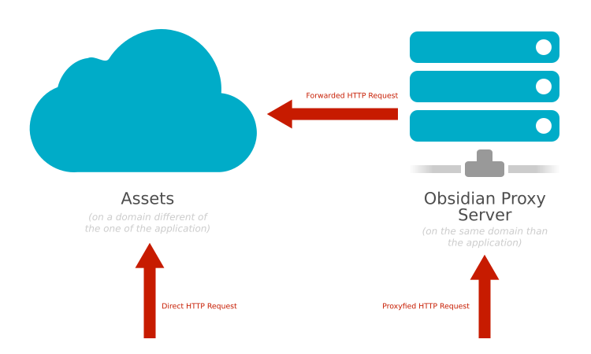

**Obsidian HTTP Request** is an helper library that allows you to download
assets and make HTTP requests either directly or through a proxy (to avoid CORS
issues, for example when using images from an other domain with a canvas).



Example:

```javascript
const httpRequest = require("obsidian-http-request");

httpRequest.getText("http://example.com/hello.txt")
    .then(function(result) {
        console.log(result);
    })
    .catch(function(error) {
        console.error(error);
    });
```
